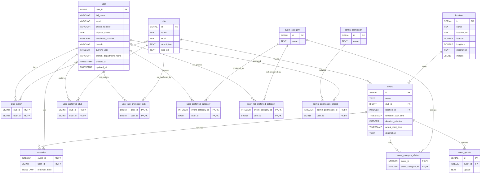

# Event Planner Backend

Backend API for the Event Planner project.

## Requirements
- Node.js 18+ (recommended)
- PostgreSQL database (local or hosted)

## Setup
1. Install dependencies:
   
   ```bash
   npm install
   ```

2. Create a `.env` file in the backend folder with the following variables:

   ```env
   DATABASE_URL=postgresql://<user>:<password>@<host>/<db>?sslmode=require

   # Channel I OAuth
   authoriseURL=https://channeli.in/oauth/authorise/
   client_id=<your_client_id>
   redirectURL=http://127.0.0.1:8081/oauth/token/
   token_URL=https://channeli.in/open_auth/token/
   client_secret_id=<your_client_secret>
   get_user_data_url=https://channeli.in/open_auth/get_user_data/

   JWT_SECRET=<your_jwt_secret>

   # Optional (set to true to reset and recreate schema on startup)
   RESET_DB=false

   # Optional permission ids (defaults are used if not set)
   EVENT_CRUD_PERMISSION_ID=1
   LOCATION_CRUD_PERMISSION_ID=2
   EVENT_CATEGORY_CRUD_PERMISSION_ID=3
   MANAGE_ADMINS_PERMISSION_ID=4
   MANAGE_CLUB_ADMINS_PERMISSION_ID=5
   ADMIN_PERMISSIONS_MANAGE_ID=6
   ```

3. Start the server:

   ```bash
   npm start
   ```

   For hot reload in development:
   ```bash
   npm run dev
   ```

## Notes
- The schema is initialized automatically on startup.
- Set `RESET_DB=true` to drop and recreate all tables (use with care).
- The API listens on `PORT` from `.env` or defaults to `8081`.

## Middlewares

**Auth**
- `userLoggedIn` checks for `auth_token` cookie and returns 401 if missing.
- `userData` verifies JWT, attaches decoded payload to `req.user` (includes `user_id`).

**Club Admin**
- `checkClubAdmin` ensures user is admin of at least one club; sets `req.club_admin.club_ids`.
- `checkClubAdminForClub` ensures user is admin of a specific club (`club_id` from params/body).

**Permissions (admin_permission_alloted based)**
- `checkEventPermission` allows if user has event CRUD permission or is club admin of the event's club.
- `checkLocationPermission` allows if user has location CRUD permission or is a club admin.
- `checkEventCategoryPermission` allows if user has event category CRUD permission or is a club admin.
- `checkManageAdminsPermission` allows only if user has manage-admins permission.
- `checkManageClubAdminsPermission` allows if user has manage-club-admins permission or is club admin for the target club.
- `checkAdminPermissionsManage` allows only if user has admin-permissions-manage permission.

**Permission IDs**
- IDs are read from env vars (see Setup). Defaults are used if not set.

## Routes

**/oauth**
- `GET /login`
- `GET /token`
- `GET /user`

**/events**
- `GET /all`
- `GET /:eventId`
- `GET /clubs/preferred`
- `GET /clubs/not-preferred`
- `GET /categories/preferred`
- `GET /categories/not-preferred`
- `POST /add`
- `PATCH /:eventId`
- `DELETE /:eventId`

**/user**
- `PATCH /preferences`

**/locations**
- `GET /all`
- `GET /:locationId`
- `POST /add`
- `PATCH /:locationId`
- `DELETE /:locationId`

**/event-categories**
- `GET /all`
- `GET /:categoryId`
- `POST /add`
- `PATCH /:categoryId`
- `DELETE /:categoryId`

**/admins**
- `GET /all`
- `GET /:userId`
- `POST /add`
- `PATCH /:userId`
- `DELETE /:userId`

**/club-admins**
- `GET /club/:clubId`
- `GET /club/:clubId/:userId`
- `POST /club/:clubId/add`
- `DELETE /club/:clubId/:userId`

**/admin-permissions**
- `GET /all`
- `GET /:permissionId`
- `PATCH /:permissionId`
- `DELETE /:permissionId`

## Database Schema

**user**
- `user_id` (PK), `full_name`, `email`, `phone_number`, `display_picture`
- `enrolment_number`, `branch`, `current_year`, `branch_department_name`
- `created_at`, `updated_at`

**club**
- `id` (PK), `name`, `email`, `description`, `logo_url`

**club_admin**
- `club_id` (FK -> club.id), `user_id` (FK -> user.user_id)
- Composite PK (`club_id`, `user_id`)

**location**
- `id` (PK), `name`, `location_url`, `latitude`, `longitude`
- `description`, `images` (JSONB)

**event**
- `id` (PK), `name`, `club_id` (FK -> club.id)
- `location_id` (FK -> location.id), `tentative_start_time`, `duration_minutes`
- `actual_start_time`, `description`
- Exclusion constraint prevents overlapping events at the same location

**event_category**
- `id` (PK), `name`

**event_category_alloted**
- `event_id` (FK -> event.id), `event_category_id` (FK -> event_category.id)
- Composite PK (`event_id`, `event_category_id`)

**event_update**
- `id` (PK), `event_id` (FK -> event.id), `update`

**reminder**
- `event_id` (FK -> event.id), `user_id` (FK -> user.user_id), `reminder_time`
- Composite PK (`event_id`, `user_id`)

**user_preferred_club**
- `club_id` (FK -> club.id), `user_id` (FK -> user.user_id)
- Composite PK (`club_id`, `user_id`)

**user_not_preferred_club**
- `club_id` (FK -> club.id), `user_id` (FK -> user.user_id)
- Composite PK (`club_id`, `user_id`)

**user_preferred_category**
- `event_category_id` (FK -> event_category.id), `user_id` (FK -> user.user_id)
- Composite PK (`event_category_id`, `user_id`)

**user_not_preferred_category**
- `event_category_id` (FK -> event_category.id), `user_id` (FK -> user.user_id)
- Composite PK (`event_category_id`, `user_id`)

**admin_permission**
- `id` (PK), `name`

**admin_permission_alloted**
- `admin_permission_id` (FK -> admin_permission.id), `user_id` (FK -> user.user_id)
- Composite PK (`admin_permission_id`, `user_id`)

## ER Diagram


